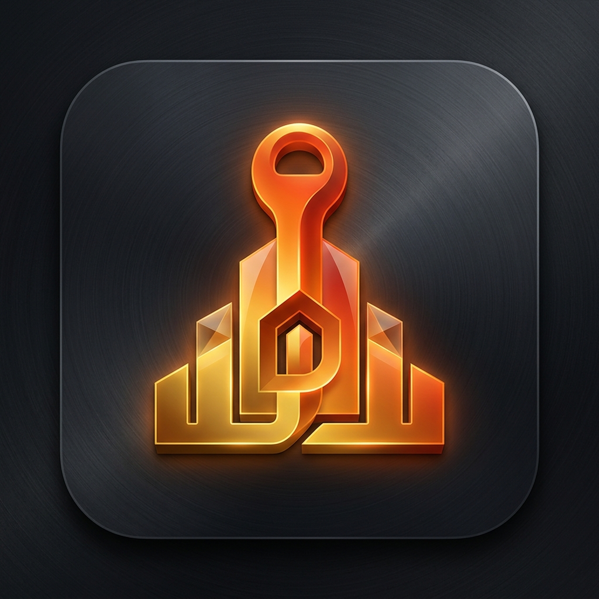

<div align="center">

# 🏠 DormHQ — Premium Hostel Management System

### A modern, full-stack hostel management platform built with React, Vite & Supabase

[](https://hostel-management-demo.vercel.app)
[](https://react.dev)
[](https://vitejs.dev)
[](https://supabase.com)
[](LICENSE)

<br/>



**DormHQ** is a production-grade hostel management system designed for Bangladesh Christian Hostel (BCH) and adaptable to any residential institution. It features glassmorphic UI, real-time data, GPS-tracked check-ins, billing, meal planning, and much more.

</div>

---

## ✨ Features

### 🎯 Core Modules

| Module | Description |
|--------|-------------|
| **📊 Dashboard** | Real-time stats, floor occupancy bars, hostel map, pending revenue & activity feed |
| **🏠 Room Management** | Full CRUD for rooms with floor, type, capacity, amenities & status tracking |
| **👤 Resident Management** | Complete resident profiles with NID, photo, emergency contacts & status |
| **🔑 Check-In / Check-Out** | GPS-tracked check-in/out with reverse-geocoded addresses & time logs |
| **💳 Billing & Fees** | Invoice generation, payment tracking (bKash/Nagad/Cash), overdue alerts, receipt PDF export |
| **🍽️ Meal Planner** | Daily meal scheduling (breakfast/lunch/dinner) with special meal flags |
| **📢 Complaints** | Categorized complaint system with priority levels & resolution tracking |
| **🔄 Readmission** | Readmission workflow with fee tracking & room reassignment |
| **🔔 Notifications** | Real-time push notifications via Supabase Realtime |
| **📈 Reports & Analytics** | CSV/PDF export of rooms, residents, fees & activity data |
| **⚙️ Settings** | Full hostel configuration — name, currency, coordinates, fees, email templates |

### 🎨 Design & UX

- **5 Premium Themes** — Midnight, Slate (Light), Ocean, Forest, Crimson
- **Glassmorphism UI** — Frosted glass sidebar & topbar with `backdrop-filter: blur(24px)`
- **Animated Mesh Background** — Subtle radial gradient animation on `<body>`
- **Micro-Interactions** — Floating card hovers with accent-colored glow shadows
- **Framer Motion** — Smooth page transitions & animated elements
- **Responsive Design** — Mobile sidebar overlay with hamburger menu
- **Collapsible Sidebar** — Full & compact navigation modes
- **Bilingual (EN/BN)** — Full English & Bengali language support

### 🗺️ Interactive Map

- **Leaflet + OpenStreetMap** integration
- Auto-switches between dark (CartoDB) & light (OSM) tile layers based on theme
- GPS marker for hostel location with check-in/out entry markers
- Today's log table with real-time status

---

## 🛠️ Tech Stack

| Layer | Technology |
|-------|-----------|
| **Frontend** | React 18, Vite 5, Framer Motion |
| **Styling** | Vanilla CSS, Google Fonts (Outfit, Space Grotesk), Glassmorphism |
| **Backend** | Supabase (PostgreSQL, Auth, Realtime, RLS) |
| **Map** | Leaflet, React-Leaflet, CartoDB Dark Matter tiles |
| **PDF/CSV** | jsPDF, jsPDF-AutoTable, PapaParse |
| **Auth** | Supabase Auth with role-based access (Admin/Student) |
| **Notifications** | React Hot Toast, Supabase Realtime subscriptions |

---

## 📁 Project Structure

```
Hostel-Management/
├── index.html                  # Entry HTML
├── package.json                # Dependencies & scripts
├── vite.config.js              # Vite configuration
├── supabase_schema.sql         # Complete database schema (run in Supabase SQL Editor)
├── .env.example                # Environment variable template
├── src/
│   ├── main.jsx                # App entry point (Leaflet CSS, Toaster)
│   ├── App.jsx                 # Root layout — sidebar, topbar, routing
│   ├── index.css               # Complete design system — themes, glassmorphism, components
│   ├── assets/
│   │   └── logo.png            # Premium 3D app icon
│   ├── components/
│   │   ├── ui.jsx              # Reusable UI primitives (SvgIcon, ICONS, Badge, Spinner, Empty)
│   │   ├── PremiumLogo.jsx     # SVG logo variants
│   │   ├── MapMonitor.jsx      # Leaflet map with GPS markers & entry logs
│   │   └── StudentDashboard.jsx# Student-specific dashboard view
│   ├── context/
│   │   └── AppContext.jsx      # Global state — auth, theme, settings, notifications
│   ├── lib/
│   │   ├── supabase.js         # Supabase client & all API functions
│   │   └── i18n.js             # Bilingual translation system (EN/BN)
│   └── pages/
│       ├── Dashboard.jsx       # Admin dashboard with stats, map, activity
│       ├── Rooms.jsx           # Room CRUD & floor grid view
│       ├── Residents.jsx       # Resident CRUD & profile cards
│       ├── CheckInOut.jsx      # GPS check-in/out with geolocation
│       ├── Billing.jsx         # Fee management, receipts, PDF export
│       ├── Home.jsx            # Landing page (pre-auth)
│       └── OtherPages.jsx      # Meals, Complaints, Readmission, Notifications, Reports, Settings, Auth
└── dist/                       # Production build output
```

---

## 🚀 Getting Started

### Prerequisites

- **Node.js** ≥ 18
- **npm** ≥ 9
- A free [Supabase](https://supabase.com) account

### 1. Clone & Install

```bash
git clone https://github.com/Ti838/Hostel-Management.git
cd Hostel-Management
npm install
```

### 2. Setup Supabase

1. Create a new project at [supabase.com](https://supabase.com)
2. Go to **SQL Editor** → **New Query**
3. Paste the entire contents of `supabase_schema.sql` and click **Run**
4. Go to **Settings** → **API** and copy your **Project URL** and **anon/public key**

### 3. Configure Environment

```bash
cp .env.example .env
```

Edit `.env` and add your Supabase credentials:

```env
VITE_SUPABASE_URL=https://your-project.supabase.co
VITE_SUPABASE_ANON_KEY=your-anon-key-here
```

### 4. Run Development Server

```bash
npm run dev
```

Open [http://localhost:5173](http://localhost:5173) in your browser.

### 5. Build for Production

```bash
npm run build
npm run preview
```

---

## 🔐 Authentication & Roles

| Role | Access |
|------|--------|
| **Admin** | Full access — Dashboard, Rooms, Residents, Billing, Reports, Settings |
| **Student** | Limited — Personal dashboard, own check-in/out, complaints, meal schedule |

- Auth is handled via **Supabase Auth** with email/password
- On sign-up, a `profiles` row is created automatically via a database trigger
- Role is set to `student` by default; promote to `admin` via Supabase dashboard

---

## 🗄️ Database Schema

The complete schema is in [`supabase_schema.sql`](supabase_schema.sql) and includes:

| Table | Purpose |
|-------|---------|
| `rooms` | Room inventory with floor, type, capacity, status |
| `residents` | Resident profiles with NID, emergency contacts |
| `room_assignments` | Check-in/out log with GPS coordinates |
| `fees` | Billing records with payment methods & receipts |
| `meals` | Daily meal schedules |
| `complaints` | Complaint tracking with categories & priorities |
| `notifications` | Real-time notification system |
| `readmissions` | Readmission workflow |
| `hostel_settings` | Global hostel configuration |
| `profiles` | User roles extending Supabase Auth |
| `transportation_*` | Vehicle, route & booking management |

All tables have **Row Level Security (RLS)** enabled with admin/student policies.

---

## 🌐 Deployment

### Vercel (Recommended)

```bash
npm run build
# Deploy the `dist/` folder to Vercel
```

Add environment variables in Vercel dashboard:
- `VITE_SUPABASE_URL`
- `VITE_SUPABASE_ANON_KEY`

### Netlify

Same process — deploy the `dist/` folder and set environment variables.

---

## 📸 Screenshots

| Dark Mode (Midnight) | Light Mode (Slate) |
|---|---|
| Glassmorphic sidebar with animated mesh background | Clean white glass UI with soft shadows |

---

## 🤝 Contributing

1. Fork the repository
2. Create a feature branch: `git checkout -b feature/amazing-feature`
3. Commit your changes: `git commit -m 'Add amazing feature'`
4. Push to branch: `git push origin feature/amazing-feature`
5. Open a Pull Request

---

## 📄 License

This project is licensed under the **MIT License** — see the [LICENSE](LICENSE) file for details.

---

<div align="center">

**Built with ❤️ by [Timon Biswas](https://github.com/Ti838)**

*DormHQ — Making hostel management effortless.*

</div>
